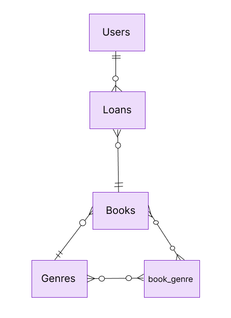

# Design Document
My Library by Eduardo Navio Maya

Video overview: <https://youtu.be/jklY__ygHj4>

## Scope

The CS50SQL database includes all the necessary entities to facilitate the tracking of users who register in a library, as well as the loans they request and the storage and marking of the books themselves. This database includes:

* Users
* Books
* Book genres
* Loans
* Relationship between books and genres

Out of scope would be, for example, book prices, user passwords, types of loan periods, and other non-essential attributes.

## Functional Requirements
This database will support:

* Adding/removing books
* Tracking loans for each user
* Adding/removing users
* Tracking book locations and quantities
* Adding explanatory notes in loans

## Representation
The entities are captured in SQLite tables with the following schema.
### Entities
The database includes the following entities:

#### users
The `users` table includes:

* `id` The id specifies a unique identifier, being the `PRIMARY KEY` of this table. It is a unique number that auto-increments as new users are added.
* `first_name` It's the real name of the user, using the text `VARCHAR` key, and adding a `NOT NULL` to enforce the entry of this essential data.
* `last_name` It's the last name of the user, using the text `VARCHAR` key, and adding a `NOT NULL` to enforce the entry of this essential data.
* `address` It's the address of the user, using the text `VARCHAR` key, and adding a `NOT NULL` to enforce the entry of this essential data.
* `registration_date` It's when the user first registered, using the text `VARCHAR` key, and adding a `NOT NULL` to enforce the entry of this essential data.
* `name_user` It is the username within this library, using the text `VARCHAR` key, and adding a `NOT NULL` to enforce the entry of this essential data, and it is a `UNIQUE` data type; there cannot be two identical ones.

#### books
The `books` table include:

* `id` The id specifies a unique identifier, being the `PRIMARY KEY` of this table. It is a unique number that auto-increments as new books are added.
* `title` It is the specific title of the book, using the text `VARCHAR` key that supports different ranges of text, and `NOT NULL` is also added because the book is obligated to have a title.
* `author` It is the specific author of the book, using the text `VARCHAR` key that supports different ranges of text, and `NOT NULL` is also added because the book is obligated to have an author.
* `acquisition_date` It is the acquisition date of the book in the library, using the `DATE` input, which is the date in year-month-day format, and another `NOT NULL` value to enforce the obligation of entering this data.
* `isbn` This is the default identifier for each particular book, collected in a text `VARCHAR` key that accepts different ranges of text, and `NOT NULL` is also added because the book is obliged to have an ISBN.
* `language` This is the language in which the book is written, and the data is collected in a text `VARCHAR` key that accepts different ranges of text.
* `quantity` This is the total quantity available in the library for a particular book, stored in `TINYINT` that accepts small numerical parameters, along with `NOT NULL` since it has to be a number greater than or equal to zero.
* `quantity_avaiable` This is the available quantity in the library for a particular book, stored in `TINYINT` that accepts small numerical parameters, along with `NOT NULL` since it has to be a number greater than or equal to zero.
* `location` This is the location of the book in the library, recorded in `VARCHAR` text format.

#### loans
The `loans` table include:

* `id` The id specifies a unique identifier, being the `PRIMARY KEY` of this table. It is a unique number that auto-increments as new loans are added.
* `user_id` It refers to the identifier of users as a `FOREIGN KEY`.
* `book_id` It refers to the identifier of books as a `FOREIGN KEY`.
* `loan_date` It is the date on which the loan is made, stored in a key of type `DATE` that refers to the year-month-day format.
* `return_date` It is the date on which the loan is returned, stored in a key of type `DATE` that refers to the year-month-day format.
* `loan_status` It refers to the status of the loan, recorded in a text type `ENUM` that only accepts the values "In progress" or "Returned" in this case.
* `notes` It refers to possible annotations made by library staff regarding a loan to a user. It is recorded in variables of `TEXT` type since it accepts a broader range of characters.

#### genres
The `genres` table include:

* `id` The id specifies a unique identifier, being the `PRIMARY KEY` of this table. It is a unique number that auto-increments as new genres are added.
* `name` It is the name of the genre type stored as a `VARCHAR` text key, and at the same time with `NOT NULL` and `UNIQUE`, allowing the name to be both non-null and unique, as the name is essential and there are no two genre names the same.

#### book_genre
The `book_genre` table include:

* `book_id` It refers to the identification number of the books table, it is both a `PRIMARY KEY` and `FOREIGN KEY` at the same time.
* `genre_id` It refers to the identification number of the genre table, it is both a `PRIMARY KEY` and `FOREIGN KEY` at the same time.

Some columns are not mandatory since the `NOT NULL` constraint is not specified for them.

### Relationships
The below entity relationship diagram describes the relationships among the entities in the database.

As detailed by the diagram:

* A user can make many loans, but a loan can only be associated with one user, so they have a one-to-many relationship from the user's perspective, but a many-to-one relationship from the loan's perspective.
* A book can have several loans, but a loan can only involve that same book. That's why the relationship books have over loans is one-to-many, whereas the relationship from loans to books is many-to-one.
* The relationship between the `books` and `genres` tables is established through a many-to-many relationship. This is achieved through the intermediate table `book_genre`. Each book in the `books` table can be associated with multiple genres, and each genre in the `genres` table can be associated with several books. The `book_genre` table acts as a bridge between the two, recording the associations between books and genres.

## Optimizations

Finally, different indices are created to speed up searches performed by library staff. These are:

* `index_books_title`, which refers to the titles of the books, as there may be a considerable number of them, and it is expected to increase over time.
* `index_user_id`, in this case, they are created to enhance the search among existing users since there are many queries that require knowing the specific user, and there can be many users enrolled in the library.
* `index_book_id`, an index is also generated for searching the identifiers of the books since it can be used as a bridge in many joins to obtain the required data.

## Limitations

A new section could be implemented for different types of loan durations,
as well as fines for delays, etc.